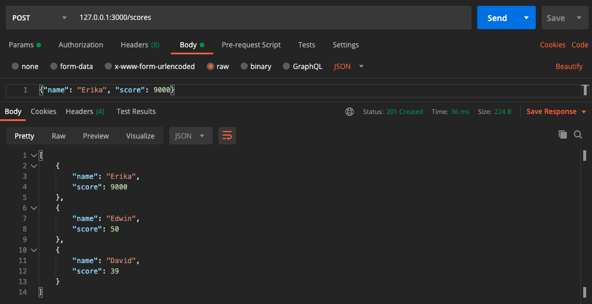

# High Score Server

Web server that keeps track of high scores in a game. The server will maintain a sorted list of the top 3 high scores, and the name associated with each.

## Instructions

-   A request to GET /scores should respond with:
    -   A status conde of 200
    -   A content-type of application/json
    -   A response body
-   A request to POST to /scores with a body:
    -   Respond with status code of 201
    -   Push the new score onto the scores array (so it shows up in subsequent GET requests)
    -   Sort the scores array so the highest scores are at the front
    -   Only keep the top 3 scores

Open the [Advanced REST Client](https://chrome.google.com/webstore/detail/advanced-rest-client/hgmloofddffdnphfgcellkdfbfbjeloo?hl=en-US) installed in Chrome, or you can use [Postman](https://www.postman.com/downloads/) to check the GET and POST requests.

_**REMEMBER** - The content of the body when you make a POST request should be in JSON format, for example:_

```bash
 {"name": "Erika", "score": 9000}
```

## Requirements

For developments, you will need [Node.js](https://nodejs.org/en/) and a node global package, [npm](https://www.npmjs.com/get-npm), installed in your environement.

## Run

To start the project you can type on the terminal:

```bash
    node scores
```

or

```bash
    npm start
```

Here is an screenshot of a POST to scores using [Postman](https://www.postman.com/)


